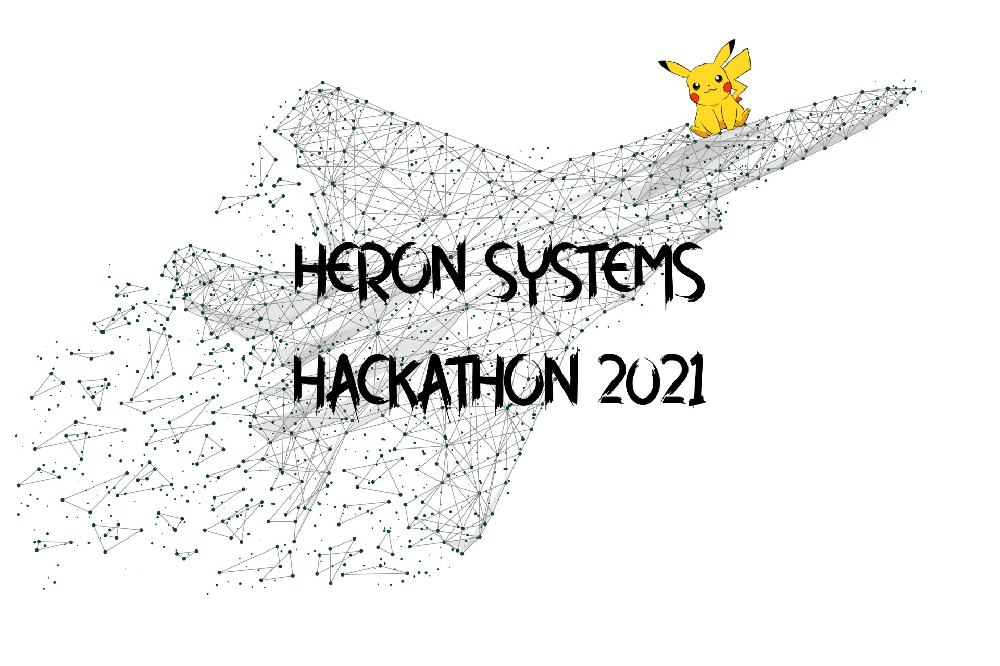
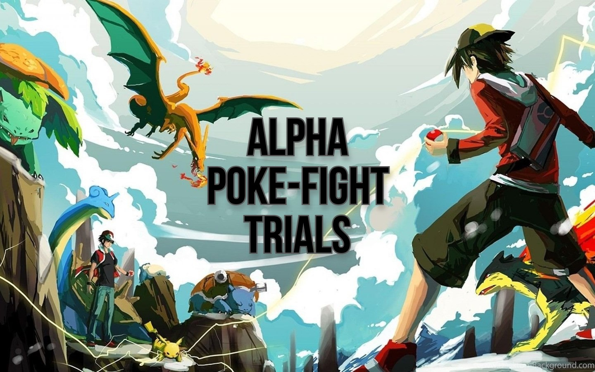

# Hackathon Heron Systems R&D 2021



# About
This repository utilizes the [Pokemon-Showdown](https://github.com/smogon/pokemon-showdown), [poke-env](https://poke-env.readthedocs.io/en/latest/getting_started.html) repositories to get the up-to-date set-up, tutorials, implementations for practicing Machine Learning Reinforcement Learning Pokemon Battle Bots against Heron's benchmark scripted agents and trained agents.

This repository contains:
- About Heron Systems.
- Rules of Hackathon and Heron Systems' MLE and SWE contact info for Hackathon Q&A.
- Resource, tips, and tricks to setup poke-env environment.
- Tutorials.

# About Heron Systems
- [Heron Systems](https://heronsystems.com/about/) is a lean organization, our leadership remains active in our technical projects, offering partners highly responsive customer service.  Our technical approach is guided by a firm commitment to quality engineering, open architecture, and flexible, extensible systems.
- We built [autonomous fighting jet](https://www.janes.com/defence-news/news-detail/heron-systems-ai-defeats-human-pilot-in-us-darpa-alphadogfight-trials).
- We broke [games balance](https://heronsystems.com/work/gamebreaker/).
- We established foundations for future [MOSAIC Warfare](https://heronsystems.com/work/gamebreaker/).
- We protected [US borders](https://heronsystems.com/work/).

# About Hackathon 2021

## 1. Rules
- You can join solo or team of 2-3 members.
- Any coding languages and frameworks are allowed.
- There are two optional projects for you to participate to Heron Systems Hackathon:
    - Option One: Build the coolest ML/RL/Robotics Project/Application.
    - Option Two: Alpha Poke-fight Trials.

## 2. Contact Infos
- Alex: Machine Learning Engineer at Heron Systems.
- Brett: President at Heron Systems.

## 3. Option One: Build the coolest ML/RL/Robotics Project/Application


- What's your/your friends'/your family's daily problems? Can you apply your ML/RL/SW skills to solve it?
- What we want to see?
    - Ability to analyze problems and come up with immediate and long-term solutions.
    - Ability to apply software/machine learning/robotics skills to solve problems.
    - Explain your approach and code clearly.
- Submission:
    - Please contact Alex to submit your solutions and projects.

## 4. Option Two: Alpha Poke-fight Trials


- You think you are good at Pokemon? Submit your agents to fight 5 rounds and get prizes.
- To enable everyone to fight with each other and compatible with our RL agents, we limit everyone to use the easy-to-use, easy-to-apply [poke-env](https://poke-env.readthedocs.io/en/latest/).
- What we want to see?
    - Ability to analyze problems and come up with immediate and long-term solutions.
    - Ability to apply software/machine learning/robotics skills to solve problems.
    - Explain your approach and code clearly.
    - Python / C++ best practice.
- Submission:
    - Please contact Alex to submit your solutions and projects.

### Top Agents:
| No.         | Agent Name  |  Training Accuracy | Testing Accuracy |
| ----------- | ----------- | ------------------ | ---------------- |
| 1           | A           | abc                | abc              |
| 2           | B           | abc                | abc              |
| 3           | C           | abc                | abc              |
| 4           | D           | abc                | abc              |
| 5           | E           | abc                | abc              |
| 6           | F           | abc                | abc              |
| 7           | G           | abc                | abc              |
| 8           | H           | abc                | abc              |
| 9           | H           | abc                | abc              |
| 10          | H           | abc                | abc              |

### Installation
- **Step 1:** On your Python workspace, install [Poke-env](https://poke-env.readthedocs.io/en/latest/) with 
    ```
    pip install poke-env
    ```
- **Step 2:** Install NodeJS v10+. 
    - [For Linux](https://github.com/nodesource/distributions/blob/master/README.md#debinstall).
    - [For Windows](https://nodejs.org/en/download/).
    - [For MacOS](https://nodejs.org/en/download/).
- **Step 3:** Set up training server.
    - Unzip src/Pokemon-Showdown-master.zip.
    ```
    cd Pokemon-Showdown
    node pokemon-showdown start --no-security
    ```
    - You should see something like this:

    ```
    RESTORE CHATROOM: lobby
    RESTORE CHATROOM: staff
    Worker 1 now listening on 0.0.0.0:8000
    Test your server at http://localhost:8000
    ```

    - "http://localhost:8000" is the local server that you will use to train your ML/RL agents.
- **Step 4:** Read the documentations of [poke-env](https://poke-env.readthedocs.io/en/latest/index.html), explore the environment, and build your best pokemon-bot.
    - Additional tutorials are provided below.
- **Step 5:** When you are done, feel free to challenge your friends' bots or us to win prizes.

### Tips
- Make sure that you create an Pokemon Showdown account for your bot. This will help you to challenge our bots.
- After training, make two Pokemon Showdown account for you and your bot and see if you can fight your bot. If yes, then your bot is ready to fight Heron's Top Agents.

## 5. Resources
### Supplements:
- Pokemon:
    - [What is Pokemon?](https://en.wikipedia.org/wiki/Pok%C3%A9mon). ¯\\\_(ツ)_/¯
    - [Pokemon Showdown](https://pokemonshowdown.com/).
    - Pokemon Showdown [Intro Guidelines](https://www.smogon.com/forums/threads/the-beginners-guide-to-pokemon-showdown.3676132/).
    - Pokemon Showdown [repo](https://github.com/hsahovic/Pokemon-Showdown).
- Reinforcement Learning Intro Resources:
    - [OpenAI Spinning Up](https://spinningup.openai.com/en/latest/).
    - [David Silver's Course](https://www.davidsilver.uk/teaching/).
    - [Lilian Weng's Blog](https://lilianweng.github.io/lil-log/2018/04/08/policy-gradient-algorithms.html).
    - [Berkeley's Deep RL Bootcamp](https://sites.google.com/view/deep-rl-bootcamp/lectures).
    - [Berkeley's Deep Reinforcement Learning Course](http://rail.eecs.berkeley.edu/deeprlcourse/).
    - [More Resources](https://github.com/dennybritz/reinforcement-learning).

- Recommended Developing Environments:
    - [Poke-env]() itself.
    - [Stable Baselines](https://stable-baselines.readthedocs.io/en/master/index.html). Not Stable Baselines 3.
    - [RLlib](https://docs.ray.io/en/master/rllib.html).

### Tutorial 1
- Check out poke-env [examples](https://poke-env.readthedocs.io/en/latest/examples.html).

### [Tutorial 2: Scripted Agents Fight On Pokemon Showdown](https://github.com/mnguyen0226/hackathon_hs/tree/main/src/tutorials/tutorials_two/t2.md)

### [Tutorial 3: You vs Scripted Agent On Pokemon Showdown](https://github.com/mnguyen0226/hackathon_hs/blob/main/src/tutorials/tutorials_three/t3.md)

### [Tutorial 4: Random Agent vs Max Damage Agent On Pokemon Showdown](https://github.com/mnguyen0226/hackathon_hs/blob/main/src/tutorials/tutorials_four/t4.md)

### [Tutorial 5: Trained DQN RL Agents with Stable Baselines](https://github.com/mnguyen0226/hackathon_hs/blob/main/src/tutorials/tutorial_five/t5.md)

### [Tutorial 6: You vs Trained DQN RL Agent with Stable Baselines On Pokemon Showdown](https://github.com/mnguyen0226/hackathon_hs/blob/main/src/tutorials/tutorial_six/t6.md)